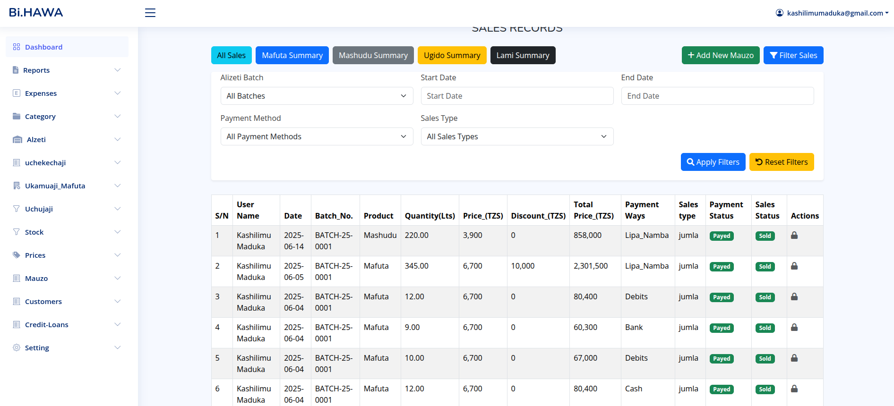
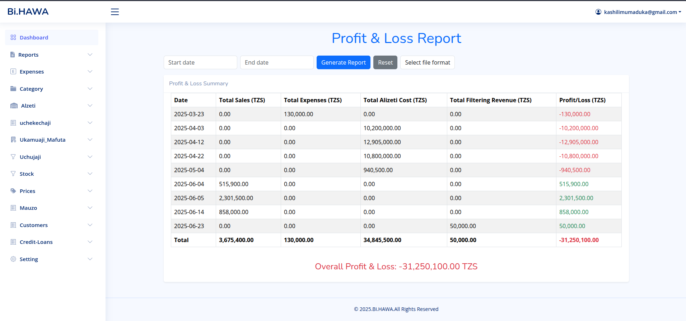
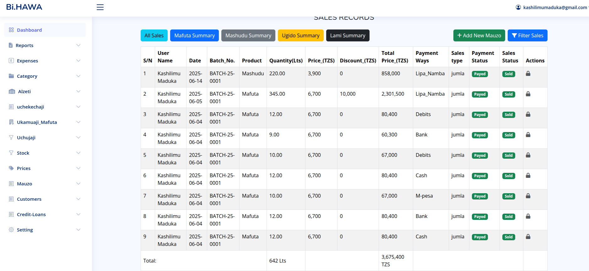

# My Awesome Laravel Project

Welcome to the repository for my Laravel-based web application! This project provides robust management for sales, product transactions, and filtering operations, designed for efficiency and ease of use.

## Project Overview

This application serves as a comprehensive system for managing various business operations, including:
* **Sales Tracking**: Detailed records of product sales, including quantities, prices, discounts, and payment methods.
* **Product Transactions**: Management of product collections and sales specifically for customer batches.
* **Filtering Operations**: Recording and tracking the crude oil filtering process and resulting products (refined oil, mashudu, ugido, lami).
* **User Management**: Basic user authentication and roles (implied by user tracking in transactions).
* **Reporting**: Profit & Loss reports for financial oversight.

## Technologies Used

* **Backend**: Laravel (PHP Framework)
* **Frontend**: Blade Templates, Bootstrap 5, JavaScript, SweetAlert2 for user feedback.
* **Database**: MySQL (or any database supported by Laravel Eloquent)
* **Version Control**: Git / GitHub

---

## Screenshots

Here are some visual representations of the application's key interfaces to give you a better understanding of its functionality and design.

###filtering records 
This screenshot displays summary of certain records when some one wants to get specific records

### report summary
A view dedicated to summarizing sales reports and all costs specifically 

### sales
This section shows the records for product transactions (collections and sales) related to specific customer batches.

-